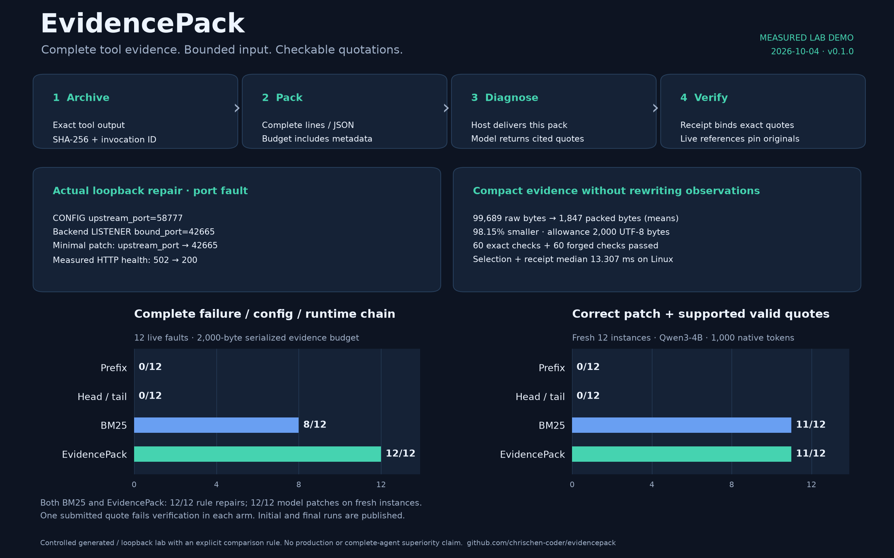

# EvidencePack

**让 Agent 在有限输入预算内拿到完整证据，并核验它引用的内容。**

[English](README.md) · [设计与开发计划](docs/design.md) ·
[接入说明](docs/integration.md) · [实测与复现](docs/results.md) ·
[已有工作的对照](docs/related-work.md)

## 谁来用？输入、输出是什么？

这是给 **Agent 应用开发者** 接入的 Python 库，接在工具执行与模型输入之间。
证据处理本身在 CPU 上运行，不需要显卡；诊断由开发者已有的大模型完成。

```text
工具返回的日志、配置或 JSON + 当前问题 + 输入预算
                     ↓ EvidencePack
证据 JSON：选中的完整片段、来源、行号/记录位置、引用编号、证据包编号
                     ↓ 你已有的大模型
诊断结论 + 引用编号 + 逐字引文
                     ↓ EvidencePack 核验
引文通过 / 引文不匹配；应用再决定是否接受回答
```

| 调用 | 开发者提供的输入 | 库返回的输出 |
| --- | --- | --- |
| `capture(source, text)` | 来源名称和原始文本；JSON 文本可加 `media_type="json"` | 保存结果及其 ID |
| `pack(question, ids, budget=2000)` | 要解决的问题、已保存结果的 ID、预算 | 证据包；`pack.to_json()` 可送给模型 |
| `verify(pack.receipt, citation, quote)` | 证据包编号、片段的引用编号、模型给出的引文 | `valid` 是否匹配，以及 `reason` 原因 |

“回执”就是用于后续核验的证据包编号。库返回的是证据，最终诊断由你的模型生成。
核验通过表示引文对得上，不表示模型的整段推理一定正确。

安装后执行 `python -m examples.quickstart`，可以看到实际输入和两种输出。
这个最小示例使用生成的日志和预设引文，明确不调用模型，也不产生真实诊断。
开发者接入时，将示例字符串替换为自己的工具结果，把证据 JSON 交给已有模型，
要求它附引用编号和逐字引文，再调用 `verify()` 检查。
[工具中间件示例](examples/tool_middleware.py)展示了如何包装已有工具调用。

## 背景与问题

运维 Agent 为了一次诊断，可能读取大量日志、配置和命令输出。真正决定结论的内容
往往只有几行：一次失败请求、实际配置、后端监听状态。只保留开头会漏掉中间的
故障；让模型摘要可能改写端口、请求 ID 或错误码；把原文存成文件，也无法单独证明
回答中的引文来自本次给模型的证据包。

EvidencePack 把这个边界做成独立组件：宿主先保存原始工具输出，再按任务选择完整
片段，在计算过元数据开销的预算内返回证据包，最后按包的回执核验模型引文。
它适合日志诊断、命令输出分析和 JSON 工具结果处理。



## 怎么解决

1. **完整保存。** 每次工具调用独立编号，保存原始 UTF-8 内容和 SHA-256，避免同秒
   文件名覆盖。恢复原文时检查作用域、删除状态和摘要。
2. **完整选择。** 文本按完整行窗口、JSON 按完整记录和指针组织。BM25 检索先兼顾
   各次采集，再按相关度与体积填充预算，优先呈现最相关片段；重复噪声不反复占位。
3. **准确计量。** 预算覆盖最终 JSON、引用 ID 和元数据。默认单位是字节；接入模型
   时可以使用其真实 tokenizer。超大记录明确省略，必要时按更小范围重新读取。
4. **按回执核验。** 引文必须逐字出现在这个回执选中的片段里。原文其他位置有同样的
   内容，并不足以通过；核验结果也不代表引文能证明整段推理。
5. **管理生命周期。** 活跃回执保护对应原文；宿主释放后才能回收。强制删除保留
   墓碑并使相关回执失效，避免引用悄悄失去依据。

## 工程设计与价值边界

核心采用不可变领域对象、Repository/Ranker/Counter 接口、策略模式和组合服务。
持久化、检索、计量和 CLI/MCP 传输分离，核心仅八个模块、没有运行时依赖。
目录、文件、方法和契约说明为本项目重新设计；没有移入来源工程的业务代码、
数据、注释或 Git 历史。[设计文档](docs/design.md)保留分阶段开发计划和验收标准。

OpenClaw、Hermes、OpenHands 已有裁剪、摘要、文件恢复和上下文扩展能力，ClawVM
也讨论了可恢复上下文和保真约束。本项目不把这些已有能力包装成发明，也不声称
其他项目所有代码中都不存在相似机制。

具体贡献是把“完整片段、整包预算、调用来源、回执限定的引文核验、引用关联的回收”
连接成小型、可接入不同 Agent 框架的工程契约。难点是让这些约束同时成立：元数据
也占预算，片段仍能恢复，作用域不能串用，采集与回执之间发生删除必须失败关闭。
这些行为通过自动化测试验证。[对照文档](docs/related-work.md)给出了审阅源码版本。

## 运行一个真实故障 Demo

需要 Python 3.11 或更高版本：

```bash
git clone https://github.com/chrischen-coder/evidencepack.git
cd evidencepack
python -m venv .venv
source .venv/bin/activate
python -m pip install -e .
python -m examples.quickstart
python -m examples.diagnose
```

其中 `diagnose` 示例会启动两个临时本地 HTTP 进程，产生真实的 502 故障，采集输出，按选中的配置
和运行状态推导最小补丁，再请求服务验证是否变成 200。它同时展示真实引文通过、
伪造引文被拒绝，结束时清理子进程。这部分使用透明的规则修复器；5090 上的模型
评测另行记录。

```python
from evidencepack import EvidenceService, Scope, SQLiteRepository

service = EvidenceService(
    SQLiteRepository(".evidencepack/vault.sqlite"), Scope("local", "incident-1")
)
artifact = service.capture("healthcheck", "INFO ready\nERROR connection refused\n")
pack = service.pack("connection refused", [artifact.id], budget=2048)
print(pack.to_json())
excerpt = pack.excerpts[0]
assert service.verify(pack.receipt, excerpt.citation, "connection refused").valid
assert not service.verify(pack.receipt, excerpt.citation, "database corruption").valid
service.release(pack.receipt)
```

`pip install '.[tokens,mcp]'` 增加 token 计量和 MCP；`'.[eval]'` 支持本地模型的
tokenizer。宿主的系统提示、问题、聊天模板和协议外壳需要额外预留空间。
[接入说明](docs/integration.md)包含工具中间件、CLI、MCP、重新读取和回收流程。

## 实测结果

| 策略 | 压力测试完整证据 | 真实故障完整证据链 | 规则修复通过 | 新采集案例的模型补丁与引用均通过 |
| --- | ---: | ---: | ---: | ---: |
| Prefix | 0/65 | 0/12 | 0/12 | 0/12 |
| Head / tail | 20/65 | 0/12 | 0/12 | 0/12 |
| BM25 | 60/65 | 8/12 | 12/12 | 11/12 |
| EvidencePack | 60/65 | 12/12 | 12/12 | 11/12 |

在 2,000 字节预算内，真实故障的平均输入从 **99,689 降至 1,847 字节，减少 98.15%**。
Linux 上选择与回执提交的中位耗时为 13.307 毫秒。5090 使用 Qwen3-4B 和独立的
1,000 原生 token 证据预算；最终代码在复测与新采集两批案例中取得 **24/24 正确补丁、
23/24 补丁与引用均通过**。BM25 的模型总成绩相同。新采集的一批中，两者各有一次
不匹配的模型引文被拒绝。**62 项测试在 macOS 和 Linux 均通过**，包含实际 MCP 通信。

所有策略使用相同片段结构、元数据和预算。这里只比较选择策略，不能据此声称优于
完整的 OpenClaw、Hermes 或 OpenHands Agent。合成压力测试、真实进程的规则修复、
模型回答质量分别统计；失败也计入分母。第一次呈现顺序不佳的模型结果一起保留，
没有隐藏。[测量文档](docs/results.md)提供原始输入、回答、代码指纹和复现命令。

## 使用限制

回执记录的是返回给宿主的证据包，宿主须确实把该包交给模型，并关联到待核验的
回答；它不能证明网络交付或模型注意力。逐字引文核验不验证整个诊断的语义，也不
授权执行修复。工具内容仍应视为不可信数据。

作用域标签不是身份认证，摘要不是防数据库所有者篡改的签名；应把库保存在 Agent
无法直接改写的位置。检索可能漏掉同义表达，超大记录可能放不进预算，活跃回执需
及时释放。首版只支持本地文本证据；没有分布式存储、多模态或百万记录索引。
SQLite 逻辑删除不是安全擦除。

MIT 许可证。[贡献与检查流程](CONTRIBUTING.md)。
